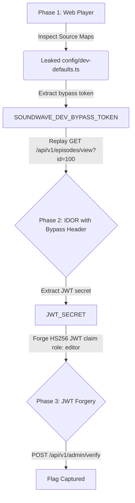

# SoundWave

## 📖 Storyline
SoundWave is a specialized audio platform where independent musicians and podcasters upload raw audio for automatic AI normalization. However, in the rush to launch the staging environment, the developers made several critical configuration errors: Webpack source maps were left enabled, API endpoints rely on guessable sequential IDs and a static validation token, and the admin panel checks token claims without checking signatures against secure production keys.

---

## 🗺️ Vulnerability Chain & Attack Path

### Phase 1: Webpack Source Map Exposure (Recon)
The Next.js production build has source maps enabled (`productionBrowserSourceMaps: true`).
* **Attack Path:** The attacker inspects the web player dashboard using browser developer tools or retrieves the static chunk mapping files. Under the reconstructed directory tree, they inspect `src/config/dev-defaults.ts` to locate a hardcoded staging token: `SOUNDWAVE_DEV_BYPASS_TOKEN`.

### Phase 2: IDOR via Media Metadata API
The Express API endpoint `/api/v1/episodes/view?id=<id>` retrieves track details based on guessable database IDs, but restricts private streams to requests containing the staging token.
* **Attack Path:** The attacker accesses the private staging test stream (ID `100`) by supplying the bypass token in the `X-Bypass-Token` header. The returned private episode description leaks the staging environment's `JWT_SECRET`.

### Phase 3: JWT Modification & The Admin Dashboard
The `/admin/analytics` dashboard is protected by JWT signature checks but trusts the leaked staging secret key.
* **Attack Path:** The attacker constructs and signs a forged HS256 JSON Web Token (JWT) with the claims `"role": "editor"` and `"username": "admin"` using the leaked secret key. Submitting this token in the header (or input box) grants administrative access and reveals the `VulnOS` flag.
